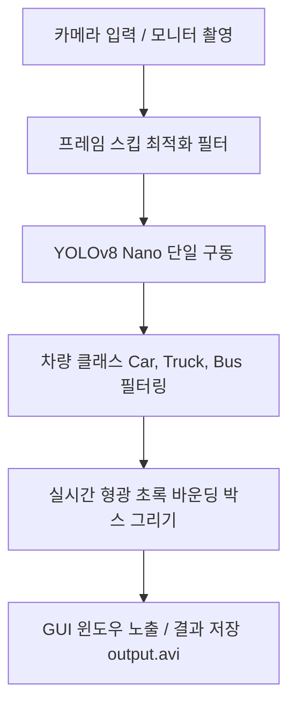

# 🚗 Raspberry Pi & YOLOv8 기반 실시간 자동차 감지 시스템 (IoT HW06)

본 프로젝트는 **라즈베리 파이(Raspberry Pi)**와 **YOLOv8 Nano** 인공지능 모델을 활용하여, 카메라가 비추는 모니터 화면 속의 **자동차(Car), 트럭(Truck), 버스(Bus)**를 실시간으로 초고속 감지하고 시각화하는 초경량 실시간 인식 시스템입니다.

과제 제출 시 **GitHub** 및 **Notion 실습 보고서**에 즉시 복사하여 업로드할 수 있도록 깔끔하게 정리되어 있습니다.

---

## 📌 주요 특징
1. **임베디드 리소스 가속 및 최적화**
   * 라즈베리 파이 CPU 및 메모리 제한을 고려하여, 용량이 매우 작고 빠른 **YOLOv8n (Nano)** 모델 단일 구동.
   * `Frame Skip` 옵션 지원: 실시간 감지 연산 프레임을 조절하여 FPS 성능을 극대화.
   * 해상도 수동 조절(예: 320x240)을 지원하여 임베디드 저사양 환경 가속.
2. **초경량 설계 및 빠른 배포**
   * 불필요한 이중 모델 로드 및 무겁고 까다로운 OCR(글자 판독) 라이브러리를 전면 배제하여, 라즈베리 파이에서 단 몇 분 만에 즉시 설치 및 실행할 수 있도록 극도로 단순화.
3. **SSH 원격 구동 환경 완벽 지원**
   * 화면 디스플레이가 연결되지 않은 CLI SSH 터미널 환경을 위해 `Headless Mode` 및 결과 비디오 녹화 저장 기능(`output.avi`) 내장.

---

## 🛠️ 개발 및 실행 환경
* **하드웨어**: Raspberry Pi 4 또는 5 / USB 웹캠 혹은 Raspberry Pi 전용 카메라
* **OS**: Raspberry Pi OS (64-bit 권장)
* **언어**: Python 3.8 이상

---

## 📦 시스템 아키텍처 (설계 구조)



---

## 🚀 설치 및 세팅 가이드 (라즈베리 파이 기준)

라즈베리 파이 터미널에 접속하여 아래의 명령어를 순서대로 실행해 주세요.

### 1. 시스템 라이브러리 필수 패키지 설치
라즈베리 파이에서 OpenCV 및 이미지 라이브러리가 오류 없이 원활히 구동될 수 있도록 필수 시스템 라이브러리들을 설치합니다.

```bash
sudo apt update
sudo apt install -y libgl1-mesa-glx libglib2.0-0 libgstreamer1.0-0 libgstreamer-plugins-base1.0-0
```

### 2. 프로젝트 소스 코드 복제 (Git)
GitHub에 푸시된 프로젝트 코드를 라즈베리 파이 내부로 클론합니다.

```bash
git clone <본인의 GitHub 저장소 주소>
cd iot-hw06
```

### 3. 파이썬 가상환경 생성 및 패키지 설치
```bash
# 가상환경 생성 및 활성화
python3 -m venv .venv
source .venv/bin/activate

# 필수 패키지 설치 (단 3가지 핵심 라이브러리만 설치하여 고속 설치 완료)
pip install --upgrade pip
pip install -r requirements.txt
```
*(참고: 최초 실행 시 PyTorch 및 YOLOv8 공식 모델 가중치 파일(yolov8n.pt, 약 6MB)을 자동으로 단 한 번 다운로드합니다.)*

---

## 💻 실행 및 사용 방법

가상환경이 활성화된 상태(`source .venv/bin/activate`)에서 실행합니다.

### 1. 기본 실시간 실행 (카메라 GUI 환경)
카메라 창을 띄우고 모니터 속에 떠 있는 자동차를 실시간 감지합니다.
```bash
python main.py --source 0
```

### 2. 초고속 프레임 최적화 모드 (라즈베리파이 강력 추천 🚀)
매 2프레임마다 연산을 실행하고 해상도를 `320x240`으로 낮추어 가장 버벅임 없이 실행합니다.
```bash
python main.py --source 0 --frame-skip 2 --width 320 --height 240
```

### 3. 원격 터미널 환경 실행 (Headless & 파일로 녹화 저장)
SSH 원격 접속 등으로 창을 띄울 수 없을 때, 화면 표시 없이 동작 상태를 터미널로 확인하며 결과물을 비디오 파일(`output.avi`)로 녹화 및 저장합니다.
```bash
python main.py --source 0 --headless --save --save-path output.avi
```

---

## 📊 Notion 및 GitHub 과제 제출 가이드 팁!

1. **실습 방법**:
   * 노트북이나 컴퓨터 화면에 자동차 사진 또는 동영상(유튜브의 도로 주행 차량 영상 등)을 크게 띄워 둡니다.
   * 라즈베리 파이 카메라가 모니터 화면 속 차량을 정면으로 비추도록 세워 둡니다.
2. **동영상 및 캡처본 획득**:
   * `--save` 옵션을 주어 실행하여 모니터 화면 속 자동차 위에 형광색 박스가 실시간으로 생기는 감지 완료 동영상(`output.avi`)을 확보하여 Notion 보고서에 첨부합니다.
3. **성능 개선 비교 보고서**:
   * `--frame-skip 1`일 때와 `--frame-skip 2` 또는 `3`일 때의 평균 FPS(Average FPS) 차이를 비교 기술하여 **"임베디드 리소스 절약을 위한 프레임 스키핑 실험 데이터"**로 제출하면 더 높은 평가를 받을 수 있습니다.
